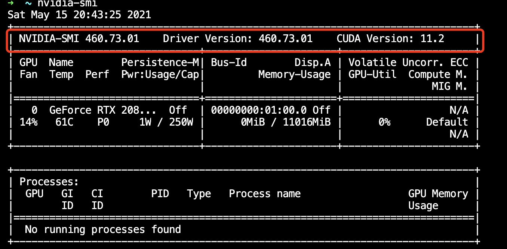

# 环境配置与PyG中图与图数据集的表示和使用

## 一、引言

[PyTorch Geometric](https://pytorch-geometric.readthedocs.io/en/latest/) (PyG)是面向几何深度学习的PyTorch的扩展库，几何深度学习指的是应用于图和其他不规则、非结构化数据的深度学习。基于PyG库，我们可以轻松地根据数据生成一个图对象，然后很方便的使用它；我们也可以容易地为一个图数据集构造一个数据集类，然后很方便的将它用于神经网络。

通过此节的实践内容，我们将

1. 首先学习**程序运行环境的配置**。
2. 接着学习**PyG中图数据的表示及其使用**，即学习PyG中`Data`类。
3. 最后学习**PyG中图数据集的表示及其使用**，即学习PyG中`Dataset`类。

## 二、环境配置

1. 使用`nvidia-smi`命令**查询显卡驱动是否正确安装**



2. 安装**正确版本的pytorch和cudatoolkit**，此处安装1.8.1版本的pytorch和11.1版本的cudatoolkit
  
   1. `conda install pytorch torchvision torchaudio cudatoolkit=11.1 -c pytorch -c nvidia`
   2. 确认是否正确安装，正确的安装应出现下方的结果
   ```txt
   $ python -c "import torch; print(torch.__version__)"
   # 1.8.1
   $ python -c "import torch; print(torch.version.cuda)"
   # 11.1
   ```
   
3. 安装**正确版本的PyG**

   ```txt
   pip install torch-scatter -f https://pytorch-geometric.com/whl/torch-1.8.0+cu111.html
   pip install torch-sparse -f https://pytorch-geometric.com/whl/torch-1.8.0+cu111.html
   pip install torch-cluster -f https://pytorch-geometric.com/whl/torch-1.8.0+cu111.html
   pip install torch-spline-conv -f https://pytorch-geometric.com/whl/torch-1.8.0+cu111.html
   pip install torch-geometric
   ```

**其他版本的安装方法**以及**安装过程中出现的大部分问题的解决方案**可以在[Installation of of PyTorch Geometric ](https://pytorch-geometric.readthedocs.io/en/latest/notes/installation.html)页面找到。

## 三、`Data`类——PyG中图的表示及其使用

### `Data`对象的创建

`Data`类的官方文档为[torch_geometric.data.Data](https://pytorch-geometric.readthedocs.io/en/latest/modules/data.html#torch_geometric.data.Data)。

#### 通过构造函数

**`Data`类的构造函数**：

```python
class Data(object):

    def __init__(self, x=None, edge_index=None, edge_attr=None, y=None, **kwargs):
    r"""
    Args:
        x (Tensor, optional): 节点属性矩阵，大小为`[num_nodes, num_node_features]`
        edge_index (LongTensor, optional): 边索引矩阵，大小为`[2, num_edges]`，第0行为尾节点，第1行为头节点，头指向尾
        edge_attr (Tensor, optional): 边属性矩阵，大小为`[num_edges, num_edge_features]`
        y (Tensor, optional): 节点或图的标签，任意大小（，其实也可以是边的标签）
	
    """
    self.x = x
    self.edge_index = edge_index
    self.edge_attr = edge_attr
    self.y = y

    for key, item in kwargs.items():
        if key == 'num_nodes':
            self.__num_nodes__ = item
        else:
            self[key] = item

```

`edge_index`的每一列定义一条边，其中第一行为边起始节点的索引，第二行为边结束节点的索引。这种表示方法被称为**COO格式（coordinate format）**，通常用于表示稀疏矩阵。PyG不是用稠密矩阵$\mathbf{A} \in \{ 0, 1 \}^{|\mathcal{V}| \times |\mathcal{V}|}$来持有邻接矩阵的信息，而是用仅存储邻接矩阵$\mathbf{A}$中非$0$元素的稀疏矩阵来表示图。

通常，一个图至少包含`x, edge_index, edge_attr, y, num_nodes`5个属性，**当图包含其他属性时**，我们可以通**过指定额外的参数使`Data`对象包含其他的属性**：

```python
graph = Data(x=x, edge_index=edge_index, edge_attr=edge_attr, y=y, num_nodes=num_nodes, other_attr=other_attr)
```

#### 转`dict`对象为`Data`对象

我们也可以**将一个`dict`对象转换为一个`Data`对象**：

```python
graph_dict = {
    'x': x,
    'edge_index': edge_index,
    'edge_attr': edge_attr,
    'y': y,
    'num_nodes': num_nodes,
    'other_attr': other_attr
}
graph_data = Data.from_dict(graph_dict)
```

`from_dict`是一个类方法：

```python
@classmethod
def from_dict(cls, dictionary):
    r"""Creates a data object from a python dictionary."""
    data = cls()
    for key, item in dictionary.items():
        data[key] = item

    return data
```

**注意**：`graph_dict`中属性值的类型与大小的要求与`Data`类的构造函数的要求相同。

### `Data`对象转换成其他类型数据

我们可以将`Data`对象转换为`dict`对象：

```python
def to_dict(self):
    return {key: item for key, item in self}
```

或转换为`namedtuple`：

```python
def to_namedtuple(self):
    keys = self.keys
    DataTuple = collections.namedtuple('DataTuple', keys)
    return DataTuple(*[self[key] for key in keys])
```

### 获取`Data`对象属性

```python
x = graph_data['x']
```

### 设置`Data`对象属性

```python
graph_data['x'] = x
```

### 获取`Data`对象包含的属性的关键字

```python
graph_data.keys()
```

### 对边排序并移除重复的边

```python
graph_data.coalesce()
```

### `Data`对象的其他性质

我们通过观察PyG中内置的一个图来查看`Data`对象的性质：

```python
from torch_geometric.datasets import KarateClub

dataset = KarateClub()
data = dataset[0]  # Get the first graph object.
print(data)
print('==============================================================')

# 获取图的一些信息
print(f'Number of nodes: {data.num_nodes}') # 节点数量
print(f'Number of edges: {data.num_edges}') # 边数量
print(f'Number of node features: {data.num_node_features}') # 节点属性的维度
print(f'Number of node features: {data.num_features}') # 同样是节点属性的维度
print(f'Number of edge features: {data.num_edge_features}') # 边属性的维度
print(f'Average node degree: {data.num_edges / data.num_nodes:.2f}') # 平均节点度
print(f'if edge indices are ordered and do not contain duplicate entries.: {data.is_coalesced()}') # 是否边是有序的同时不含有重复的边
print(f'Number of training nodes: {data.train_mask.sum()}') # 用作训练集的节点
print(f'Training node label rate: {int(data.train_mask.sum()) / data.num_nodes:.2f}') # 用作训练集的节点的数量
print(f'Contains isolated nodes: {data.contains_isolated_nodes()}') # 此图是否包含孤立的节点
print(f'Contains self-loops: {data.contains_self_loops()}')  # 此图是否包含自环的边
print(f'Is undirected: {data.is_undirected()}')  # 此图是否是无向图
```

## 四、`Dataset`类——PyG中图数据集的表示及其使用

PyG内置了大量常用的基准数据集，接下来我们以PyG内置的`Planetoid`数据集为例，来**学习PyG中图数据集的表示及使用**。

`Planetoid`数据集类的官方文档为[torch_geometric.datasets.Planetoid](https://pytorch-geometric.readthedocs.io/en/latest/modules/datasets.html#torch_geometric.datasets.Planetoid)。

### 生成数据集对象并分析数据集

如下方代码所示，在PyG中生成一个数据集是简单直接的。**在第一次生成PyG内置的数据集时，程序首先下载原始文件，然后将原始文件处理成包含`Data`对象的`Dataset`对象并保存到文件。**

```python
from torch_geometric.datasets import Planetoid

dataset = Planetoid(root='/dataset/Cora', name='Cora')
# Cora()

len(dataset)
# 1

dataset.num_classes
# 7

dataset.num_node_features
# 1433
```

### 分析数据集中样本

可以看到该数据集只有一个图，包含7个分类任务，节点的属性为1433维度。

```python
data = dataset[0]
# Data(edge_index=[2, 10556], test_mask=[2708],
#         train_mask=[2708], val_mask=[2708], x=[2708, 1433], y=[2708])

data.is_undirected()
# True

data.train_mask.sum().item()
# 140

data.val_mask.sum().item()
# 500

data.test_mask.sum().item()
# 1000
```

现在我们看到该数据集包含的唯一的图，有2708个节点，节点特征为1433维，有10556条边，有140个用作训练集的节点，有500个用作验证集的节点，有1000个用作测试集的节点。PyG内置的其他数据集，请小伙伴一一试验，以观察不同数据集的不同。

### 数据集的使用

假设我们定义好了一个图神经网络模型，其名为`Net`。在下方的代码中，我们展示了节点分类图数据集在训练过程中的使用。

```python
model = Net().to(device)
data = dataset[0].to(device)
optimizer = torch.optim.Adam(model.parameters(), lr=0.01, weight_decay=5e-4)

model.train()
for epoch in range(200):
    optimizer.zero_grad()
    out = model(data)
    loss = F.nll_loss(out[data.train_mask], data.y[data.train_mask])
    loss.backward()
    optimizer.step()

```

## 结语

通过此实践环节，我们学习了**程序运行环境的配置**、**PyG中`Data`对象的生成与使用**、以及**PyG中`Dataset`对象的表示和使用**。此节内容是图神经网络实践的基础，所涉及的内容是最常用、最基础的，在后面的内容中我们还将学到复杂`Data`类的构建，和复杂`Dataset`类的构建。

## 作业

- 请通过继承`Data`类实现一个类，专门用于表示“机构-作者-论文”的网络。该网络包含“机构“、”作者“和”论文”三类节点，以及“作者-机构“和“作者-论文“两类边。对要实现的类的要求：1）用不同的属性存储不同节点的属性；2）用不同的属性存储不同的边（边没有属性）；3）逐一实现获取不同节点数量的方法。

## 参考资料

- [PyTorch Geometric](https://pytorch-geometric.readthedocs.io/en/latest/)
- [Installation of of PyTorch Geometric ](https://pytorch-geometric.readthedocs.io/en/latest/notes/installation.html)
- [torch_geometric.data.Data](https://pytorch-geometric.readthedocs.io/en/latest/modules/data.html#torch_geometric.data.Data)
- [torch_geometric.datasets.Planetoid](https://pytorch-geometric.readthedocs.io/en/latest/modules/datasets.html#torch_geometric.datasets.Planetoid)

