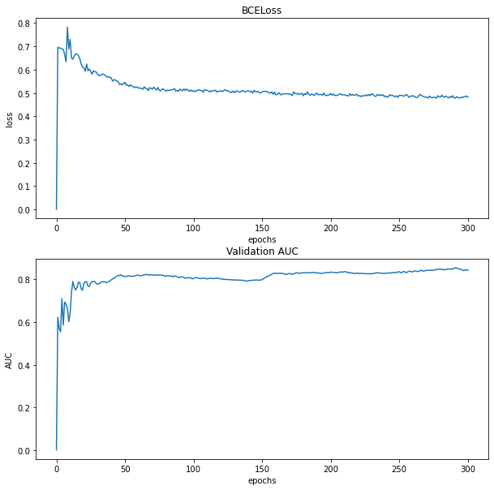

# GNN-Task-4 GraphDataset and LinkPrediction
## 1. Introduction
在GNN图神经网络的使用中，我们经常要根据实际问题和数据去自定义自己的数据集。另外，图神经网络的任务里面也会经常涉及到各种不同的预测任务(node classification, regression, link prediction等)。 所以这次的内容主要介绍一下内容
+ 怎么用torch geometric的InMemoeryDataset 去搭建自定义的数据集来加载基于内存(数据完全放在内存里面)的数据集，并且自己尝试搭建一个来实践
+ 搭建自己的GNN和图数据集进行link的预测
+ *另外鉴于前几次Datawhale对GNN博客作业评分标准不明确(一些优秀作业简单写几段自己的总结就确实实验或者是大部分是代码基本没有理论，他们的分数都比我理论+实践+自己读完paper后的理解总结的博客高分)，我这里就不参考他们提供的内容做了，直接根据自己的理解写自己的东西*

## 2. self-defined PyG Dataset 
首先这一节主要介绍怎么使用 torch_geometric 里面的InMemoryDataset,之后自己写一个自定义的InMemoryDataset的数据并测试不同的数据集
### 2.1 Introduction to InMemoryDataset
先来看看 InMemoryDataset的官方解释:
`class InMemoryDataset(root: Optional[str] = None, transform: Optional[Callable] = None, pre_transform: Optional[Callable] = None, pre_filter: Optional[Callable] = None)`
Dataset base class for creating graph datasets which fit completely into CPU memory. See here for the accompanying tutorial.
PARAMETERS
+ `root (string, optional)` – 用于存放数据集的根目录路径(默认为None)

+ `transform (callable, optional)` – A function/transform that takes in an torch_geometric.data.Data object and returns a transformed version. 

+ `pre_transform (callable, optional)` – A function/transform that takes in an torch_geometric.data.Data object and returns a transformed version. The data object will be transformed before being saved to disk. (default: None)

+ `pre_filter (callable, optional)` – A function that takes in an torch_geometric.data.Data object and returns a boolean value, indicating whether the data object should be included in the final dataset. (default: None)


由于InMemoryDataset 继承了torch_geometric.data.Dataset 基类，而这个基类调用__init__函数会调用download, process等函数， 以下是是Dataset 和InMemoryDataset 的构建函数__init__()的源码， 以及我自己画的执行的流程图

~~~Python
class Dataset(torch.utils.data.Dataset):
    def __init__(self, root: Optional[str] = None,
                 transform: Optional[Callable] = None,
                 pre_transform: Optional[Callable] = None,
                 pre_filter: Optional[Callable] = None):
        super().__init__()

        if isinstance(root, str):
            root = osp.expanduser(osp.normpath(root))

        self.root = root
        self.transform = transform
        self.pre_transform = pre_transform
        self.pre_filter = pre_filter
        self._indices: Optional[Sequence] = None

        if 'download' in self.__class__.__dict__.keys():
            self._download()

        if 'process' in self.__class__.__dict__.keys():
            self._process()
~~~


### 2.2 **Practice: InMemoryDataset Class**
**由于datawhale里面的参考代码不通用，这里我重新把这个自定义的InMemoryDataset重新写了使它能够加载不同的dataset比如Cora, Citeseer, PudMed等以及 transductive和inductive的版本**, 这个版本的InMemoryDataset 支持：
+ 下载不同的dataset
+ 下载transductive或者inductive版本的dataset
+ 可以更改下载数据集源的url
+ 可以自定义要下载哪些文件,直接把要下载的文件名以list的形式输入到raw_file_names即可


```python
import torch
from torch_geometric.data import InMemoryDataset, download_url
from torch_geometric.io import read_planetoid_data

class MyDatasetMem(InMemoryDataset):
    def __init__(self, root, url =None, raw_file_names= None, dataset_name="citeseer",
                 version="ind", transform=None, pre_transform=None):
        r"""Dataset base class for creating graph datasets which fit completely
    into CPU memory.
    See `here <https://pytorch-geometric.readthedocs.io/en/latest/notes/
    Args:
        root (string, optional): Root directory where the dataset should be
            saved. (default: :obj:`None`)
        transform (callable, optional): A function/transform that takes in an
            :obj:`torch_geometric.data.Data` object and returns a transformed
            version. The data object will be transformed before every access.
            (default: :obj:`None`)
        pre_transform (callable, optional): A function/transform that takes in
            an :obj:`torch_geometric.data.Data` object and returns a
            transformed version. The data object will be transformed before
            being saved to disk. (default: :obj:`None`)
            
        pre_filter (callable, optional): A function that takes in an
            :obj:`torch_geometric.data.Data` object and returns a boolean
            value, indicating whether the data object should be included in the
            final dataset. (default: :obj:`None`)
    
    自定义参数:
         url:  url to data source website to download dataset
         raw_file_names: raw_file_name to download
         dataset_name: name of dataset to download, like PudMed, Cora, Citeseer
         version:  
             "ind": inductive version of dataset (predict on unseen node)
             "trans": transductive version of dataset (train and predict on all visited node)
         
    """
        self.dataset_name = dataset_name
        self.root = root
        
        if url != None:
            self.url = url
        else:
            self.url = "https://github.com/kimiyoung/planetoid/raw/master/data"
        
        if version == "ind" or version == "trans":
            self.version = version
        else:
            print(f"No such version: {version}")
            self.version = ""
            assert False
        
        if raw_file_names!=None:
            self.raw_files = raw_file_names
        else:
            names = ['x', 'tx', 'allx', 'y', 'ty', 'ally', 'graph', 'test.index']
            self.raw_files = [f'{self.version}.{self.dataset_name.lower()}.{name}' for name in names]
        # call the initialize function from InMemoryDataset to 
        # download and process the dataset and save the processed dataset to processed_data.pt file
        super(MyDatasetMem, self).__init__(root, transform, pre_transform)
        print("Processed data path: ",self.processed_paths[0])
        
        #load the saved processed dataset
        self.data, self.slices = torch.load(self.processed_paths[0])
    @property
    def raw_dir(self):
        """
        return directory that stores the raw data files
        """
        return osp.join(self.root, 'raw')
    
    @property
    def raw_file_names(self):
        r"""The name of the files to find in the :obj:`self.raw_dir` folder in
        order to skip the download."""
        return self.raw_files

    @property
    def processed_file_names(self):
        r"""The name of the files to find in the :obj:`self.processed_dir`
        folder in order to skip the processing."""
        # Note: processed data is stored into torch.pt file
        return f'{self.dataset_name}_processed_data.pt'
    
    def download(self):
        """
        download data from url based on file names to raw directory
        """
        for file in self.raw_file_names:
            download_url('{}/{}'.format(self.url, file), self.raw_dir)
    
    def process(self):
        """
        Load dataset from local directory
        """
        data = read_planetoid_data(self.raw_dir, self.dataset_name.lower())
        data = data if self.pre_transform is None else self.pre_transform(data)
        torch.save(self.collate([data]), self.processed_paths[0])
        
def info(data,):
        print("Number of classes: ",data.num_classes)
        print("Number of nodes: ",data[0].num_nodes)
        print("Number of edges: ",data[0].num_edges)
        print("Number of features: ",data[0].num_features)
        
        

mydataset =MyDatasetMem( root= "./dataset/MyDatasetMed", url =None, raw_file_names= None, dataset_name="citeseer",
                 version="ind", transform=None, pre_transform=None)     
        
        
info(mydataset)

```

    Processing...
    Done!
    Processed data path:  dataset/MyDatasetMed/processed/citeseer_processed_data.pt
    Number of classes:  6
    Number of nodes:  3327
    Number of edges:  9104
    Number of features:  3703


```python
mydataset_Cora =MyDatasetMem( root= "./dataset/MyDatasetMed", url =None, raw_file_names= None, dataset_name="Cora",
                 version="ind", transform=None, pre_transform=None)     
        
        
info(mydataset_Cora)
```

    Processing...
    Done!
    Processed data path:  dataset/MyDatasetMed/processed/Cora_processed_data.pt
    Number of classes:  7
    Number of nodes:  2708
    Number of edges:  10556
    Number of features:  1433


```python
mydataset_PubMed =MyDatasetMem( root= "./dataset/MyDatasetMed", url =None, raw_file_names= None, dataset_name="pubmed",
                 version="ind", transform=None, pre_transform=None)     
        
        
info(mydataset_PubMed)
```

    Processing...
    Done!
    Processed data path:  dataset/MyDatasetMed/processed/pubmed_processed_data.pt
    Number of classes:  3
    Number of nodes:  19717
    Number of edges:  88648
    Number of features:  500


## 3. Link Prediction
图数据里面常见的任务包括了node prediction， edge prediction (classification 或者 regression)以及graph prediction等。这里介绍link prediction。 linke prediction 的目标是要判断在图里面的一对节点在未来会不会形成新的连接关系(有向或者无向)。
在实际应用场景， link prediction有大量的重要的应用比如：
+ 预测用户会不会买商品，买和被卖的关系就是一个有向的link
+ 推荐不同机构里面员工相互合作，这个合作关系也是一个连接edge prediction的任务
+ 提取社交网络里面人与人之间的关系，预测哪些人能够相互喜欢，从而相互推荐也是个link prediction的任务


### Link prediction在GNN里面的预测原理
参考下面一副图， 这个图里面有7个节点, 从A到E。而实线是已经知道的link，而虚线是要预测的link


以GNN表示Node Embedding时，假设每个node有自己的embedding， dimension= 3， 那么我们有
~~~
node A: [a1, a2, a3]
node B: [b1, b2, b3]
node C: [c1, c2, c3]
node D: [d1, d2, d3]
node E: [e1, e2, e3]
node F: [f1, f2, f3]

已经知道的edge:
source: [A,B,C,C,A,D]
target: [B,C,E,G,D,F]
~~~

那么在GNN里面计算一条undirected link的存在的possibility就是直接计算两个nodes之间的相似度之后把它通过logistics变成概率就可以变成这条link出现的可能性。比如计算节点A和节点B的link的出现的概率:

$$
\mathbf{P}(AB) = \sigma(\mathbf{v}_ a \cdot \mathbf{v}_ b)
$$

其中 $\mathbf{v}_ a \cdot \mathbf{v}_ b$ 是两个节点的embedding的点乘，即相乘后再用sum来reduce，$\sigma$是sigmoid 函数把相似度投映到[0, 1]概率区间，代表这条无向边出现的概率。

除了用GNN这种计算相似度的方法来计算link的概率外，也有像matrix factorization矩阵分解来预测边的值以及计算节点的出现frequency来计算节点与节点之间的关系(Common Neighbors之类的算法)。 可以参考以下的博客:
+ https://medium.com/neo4j/link-prediction-with-neo4j-part-1-an-introduction-713aa779fd9
+ https://www.analyticsvidhya.com/blog/2020/01/link-prediction-how-to-predict-your-future-connections-on-facebook/


## 4. Assignment
1. 尝试使用PyG中的不同的网络层去代替GCNConv，以及不同的层数和不同的out_channels，来实现节点分类任务。

2. 在边预测任务中，尝试用torch_geometric.nn.Sequential容器构造图神经网络。


```python
import torch
from torch.nn import functional as F
from torch.nn import LeakyReLU, Dropout, BCEWithLogitsLoss, Linear
from torch_geometric.datasets import Planetoid
from torch_geometric import transforms as T 
from torch_geometric.utils import train_test_split_edges, negative_sampling
from torch_geometric.nn import GCNConv, GATConv, Sequential

from sklearn.metrics import roc_auc_score
from matplotlib import pyplot as plt
import seaborn as sns
import numpy as np


# Define Mynet
class MyNet(torch.nn.Module):
    def __init__(self, in_channels, out_channels,hidden_channels_ls= [128,128], dropout_rate=0.5,random_seed=None):
        super(MyNet, self).__init__()
        torch.manual_seed(random_seed)
        
        hidden_channels_ls = [in_channels] + hidden_channels_ls
        self.conv_ls =[]
        # Task 1:  使用PyG中的不同的网络层去代替GCNConv，以及不同的层数和不同的out_channels，来实现节点分类任务。
        
        for i in range(len(hidden_channels_ls)-1):
            hd_in_channel = hidden_channels_ls[i]
            hd_out_channel = hidden_channels_ls[i+1]
            # input: x and edge_index output: x
            self.conv_ls.append( (GATConv(hd_in_channel, hd_out_channel), 'x, edge_index -> x') ) 
            self.conv_ls.append( (LeakyReLU(negative_slope=0.5)) ) 
            self.conv_ls.append( (Dropout(dropout_rate)) ) 
        # Task 2: 在边预测任务中，尝试用torch_geometric.nn.Sequential容器构造图神经网络。
        self.conv_seq = Sequential('x, edge_index', self.conv_ls)
        # classifier
        self.dropout = Dropout( dropout_rate)
        self.linear = Linear(hidden_channels_ls[-1], out_channels)
        
    def encode(self, x, edge_index):
        x = self.conv_seq(x, edge_index)
        x = self.dropout(x)
        x = self.linear(x)
        return  x

    def decode(self, z, pos_edge_index, neg_edge_index):
        edge_index = torch.cat([pos_edge_index, neg_edge_index], dim=-1)
        # multiply source and target node embedding and sum up all embedding feature values along column
        # It does dot product operation here to compute similarity between source and target nodes
        return (z[edge_index[0]] * z[edge_index[1]]).sum(dim=-1)

    def decode_all(self, z):
        prob_adj = z @ z.t()
        return (prob_adj > 0).nonzero(as_tuple=False).t()
    
    
    
def get_link_labels(pos_edge_index, neg_edge_index):
    """
    Concatenate positive edge and sampled negative  edge into a tensor
    and mark them as 1 or 0 label
    """
    num_links = pos_edge_index.size(1) + neg_edge_index.size(1)
    link_labels = torch.zeros(num_links, dtype=torch.float)
    link_labels[:pos_edge_index.size(1)] = 1.
    return link_labels

def train(data, model, optimizer, loss_fn,device):
    model.train()

    neg_edge_index = negative_sampling(
        edge_index=data.train_pos_edge_index,
        num_nodes=data.num_nodes,
        num_neg_samples=data.train_pos_edge_index.size(1))

    optimizer.zero_grad()
    z = model.encode(data.x.to(device), data.train_pos_edge_index.to(device))
    
    link_logits = model.decode(z, data.train_pos_edge_index, neg_edge_index)
    #print("link shape: ",link_logits.shape)
    link_labels = get_link_labels(data.train_pos_edge_index, neg_edge_index).to(data.x.device)
    loss = loss_fn(link_logits, link_labels)
    loss.backward()
    optimizer.step()

    return loss


@torch.no_grad()
def test(data, model,device):
    model.eval()

    z = model.encode(data.x, data.train_pos_edge_index)

    results = []
    for prefix in ['val', 'test']:
        pos_edge_index = data[f'{prefix}_pos_edge_index'].to(device)
        neg_edge_index = data[f'{prefix}_neg_edge_index'].to(device)
        # make prediction on link from model
        link_logits = model.decode(z, pos_edge_index, neg_edge_index).to(device)
        # convert prediction values to possibility
        link_probs = link_logits.sigmoid()
        # compute loss for link
        link_labels = get_link_labels(pos_edge_index, neg_edge_index)
        results.append(roc_auc_score(link_labels.cpu(), link_probs.cpu()))
    return results


def main(dataset):
    # load self-defined dataset: 这里调用之前学的 自定义的 InMemoryDataset
    epochs = 300
    random_seed = 2021
    np.random.RandomState(random_seed)
    torch.manual_seed(random_seed)
    
    data = dataset[0]
    data.train_mask = data.val_mask = data.test_mask = data.y = None
    
    device = torch.device("cuda" if torch.cuda.is_available() else "cpu")
    print(f"Using device: {device}")
    print()
    data = train_test_split_edges(data,val_ratio = 0.05, test_ratio = 0.1)
    print("Data info:")
    print(data)
    data.to(device)
    
    # define loss, optimizer and model: 这里调用选取要用的loss，模型，优化器等配置
    model = MyNet( in_channels = data.num_features, out_channels = 64,
                  hidden_channels_ls= [128,128], dropout_rate=0.5, random_seed= random_seed).to(device)
    
    loss_fn = BCEWithLogitsLoss()
    optimizer = torch.optim.Adam(model.parameters(), lr = 1e-2)
    # train model： 模型训练
    best_val_auc = test_auc = 0
    loss_ls = [0]
    val_auc_ls = [0]
    for epoch in range(1, epochs+1):
        loss = train(data, model, optimizer, loss_fn, device)
        loss_ls.append(loss.detach().item())
        # validation and test 
        val_auc, tmp_test_auc = test(data, model,device)
        #val_auc =val_auc.detach()
        #tmp_test_auc = tmp_test_auc.detach()
        val_auc_ls.append(val_auc)
        if best_val_auc < val_auc:
            best_val_auc = val_auc
            test_auc = tmp_test_auc
        if epoch%20 ==0:
            print(f'Epoch: {epoch:03d}, Loss: {loss:.4f}, Val: {val_auc:.4f}, '
              f'Test: {test_auc:.4f}')
        
            
    # Make final prediction on all links
    z = model.encode(data.x, data.train_pos_edge_index)
    final_edge_index = model.decode_all(z)
    
    torch.cuda.empty_cache()
    t =[0] + [i+1 for i in range(epochs)]
    
    fig, ax = plt.subplots(2, figsize=(10,10))
    sns.lineplot(t, loss_ls, ax= ax[0])
    sns.lineplot(t, val_auc_ls, ax= ax[1])
    ax[0].set_xlabel("epochs")
    ax[1].set_xlabel("epochs")
    ax[0].set_ylabel("loss")
    ax[1].set_ylabel("AUC")
    ax[0].set_title("BCELoss")
    ax[1].set_title("Validation AUC")
    plt.show()
    
        
    
```


```python
mydataset =MyDatasetMem( root= "./dataset/MyDatasetMed", url =None, raw_file_names= None, dataset_name="citeseer",
                 version="ind", transform=T.NormalizeFeatures())  

```

    Processed data path:  dataset/MyDatasetMed/processed/processed_data.pt


```python
main(mydataset)
```

    Using device: cuda
    
    Data info:
    Data(test_neg_edge_index=[2, 455], test_pos_edge_index=[2, 455], train_neg_adj_mask=[3327, 3327], train_pos_edge_index=[2, 7740], val_neg_edge_index=[2, 227], val_pos_edge_index=[2, 227], x=[3327, 3703])
    Epoch: 020, Loss: 0.6077, Val: 0.7825, Test: 0.7407
    Epoch: 040, Loss: 0.5646, Val: 0.7975, Test: 0.7761
    Epoch: 060, Loss: 0.5200, Val: 0.8195, Test: 0.8342
    Epoch: 080, Loss: 0.5082, Val: 0.8164, Test: 0.8379
    Epoch: 100, Loss: 0.5093, Val: 0.8038, Test: 0.8379
    Epoch: 120, Loss: 0.5089, Val: 0.8023, Test: 0.8379
    Epoch: 140, Loss: 0.5087, Val: 0.7941, Test: 0.8379
    Epoch: 160, Loss: 0.4914, Val: 0.8296, Test: 0.8425
    Epoch: 180, Loss: 0.4879, Val: 0.8310, Test: 0.8361
    Epoch: 200, Loss: 0.4980, Val: 0.8348, Test: 0.8297
    Epoch: 220, Loss: 0.4865, Val: 0.8287, Test: 0.8265
    Epoch: 240, Loss: 0.4870, Val: 0.8295, Test: 0.8265
    Epoch: 260, Loss: 0.4869, Val: 0.8362, Test: 0.8459
    Epoch: 280, Loss: 0.4825, Val: 0.8473, Test: 0.8488
    Epoch: 300, Loss: 0.4821, Val: 0.8434, Test: 0.8483


    /home/wenkanw/.conda/envs/mlenv/lib/python3.8/site-packages/seaborn/_decorators.py:36: FutureWarning: Pass the following variables as keyword args: x, y. From version 0.12, the only valid positional argument will be `data`, and passing other arguments without an explicit keyword will result in an error or misinterpretation.
      warnings.warn(
    /home/wenkanw/.conda/envs/mlenv/lib/python3.8/site-packages/seaborn/_decorators.py:36: FutureWarning: Pass the following variables as keyword args: x, y. From version 0.12, the only valid positional argument will be `data`, and passing other arguments without an explicit keyword will result in an error or misinterpretation.
      warnings.warn(


    

    


3. 如下方代码所示，我们以data.train_pos_edge_index为实际参数来进行训练集负样本采样，但这样采样得到的负样本可能包含一些验证集的正样本与测试集的正样本，即可能将真实的正样本标记为负样本，由此会产生冲突。但我们还是这么做，这是为什么？

~~~Python
neg_edge_index = negative_sampling(
    edge_index=data.train_pos_edge_index,
    num_nodes=data.num_nodes,
    num_neg_samples=data.train_pos_edge_index.size(1))
~~~

这里的原因有可能是因为在negative_sampling里面设置的force_undirect 默认是False,即采样的边是有向的，但是我们输入的采样的边是无向的，这样在negative sampling时把正样本(已经知道的边)也采样进去可以考虑一条边的不同方向。

## 5. Reference
[1] Datawhale https://github.com/datawhalechina/team-learning-nlp/blob/master/GNN/Markdown%E7%89%88%E6%9C%AC/6-2-%E8%8A%82%E7%82%B9%E9%A2%84%E6%B5%8B%E4%B8%8E%E8%BE%B9%E9%A2%84%E6%B5%8B%E4%BB%BB%E5%8A%A1%E5%AE%9E%E8%B7%B5.md
[2] PyG 源码: https://github.com/rusty1s/pytorch_geometric/blob/master/examples/link_pred.py

[3] https://pytorch-geometric.readthedocs.io/en/latest/modules/nn.html
[4] https://medium.com/neo4j/link-prediction-with-neo4j-part-1-an-introduction-713aa779fd9
[5] https://www.analyticsvidhya.com/blog/2020/01/link-prediction-how-to-predict-your-future-connections-on-facebook/


```python

```
